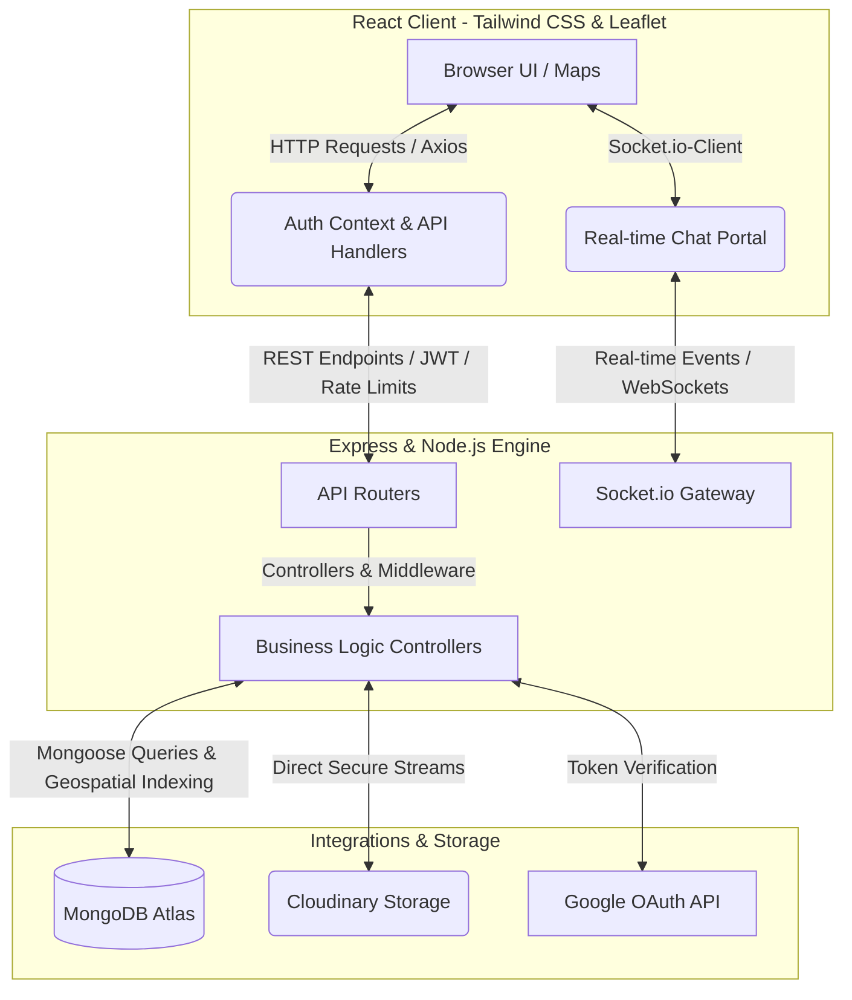

# 🚀 Zeroly — Hyperlocal Community Reuse & Swap Platform

*Turn unused goods into community good, lead a zero-waste lifestyle, and gamify sustainability.*


## 🌟 About the Project

**Zeroly** is a state-of-the-art, high-performance hyperlocal community reuse and swap marketplace. Built for maximum speed, ease of use, and premium aesthetics, Zeroly gamifies the zero-waste process. It enables neighbors to effortlessly swap, request, and donate usable goods within their immediate vicinity—fostering community bond and shrinking carbon footprints.

### ✨ Key Features

- 📍 **Geospatial Map Integration & Picker**: Dynamic maps powered by **Leaflet** combined with autocomplete-driven search inputs. Users drop a precise pin on their location to search or list goods within a customized radius.
- 🔐 **Secure Dual Auth System**: Enterprise-grade security featuring traditional email-password authentication (secured with bcrypt & JWT tokens) alongside seamless single-click **Google Sign-In OAuth 2.0**.
- ☁️ **Optimized Media Pipeline**: High-performance, direct-to-cloud image uploads powered by **Cloudinary**. Hardened with rate limits, file size filters, and robust server-side error handlers.
- 🏆 **Gamified EcoCoin Economy & Leaderboards**: Incentive-based gameplay using **EcoCoins**. Earn points by registering, listing items, and completing community handovers to climb through a dynamic tier hierarchy.
- 💬 **Real-time Peer-to-Peer Chat**: Instant, low-latency communication channel powered by **Socket.io** enabling donors and takers to coordinate handovers in real time.
- 🙋 **Glassmorphic Interactive FAQ Center**: An extremely responsive, fluid FAQ dashboard containing micro-interactions and smooth accordion animations.
- 🎨 **Premium UI/UX System**: Elegant glassmorphic interface built using Tailwind CSS v4, smooth physics-based micro-animations via `framer-motion`, and custom UI controls from `@base-ui/react` and `lucide-react`.

---

## 🏗️ System Architecture & Workflow

Zeroly utilizes a modern microservice-inspired architecture where the React SPA securely communicates with a Node/Express REST & WebSocket gateway. Real-time events, file systems, and databases are seamlessly integrated to guarantee high performance and scalability.



---

## 🏆 The EcoCoin Economy & Progress Tiers

Zeroly encourages zero-waste behaviors by gamifying community engagement with **EcoCoins**. Users earn coins by performing environment-friendly actions and climb the community leaderboard.

### 🪙 Earning EcoCoins

| Activity | EcoCoins Impact | Description |
| :--- | :---: | :--- |
| **New Account Registration** | `+1 EcoCoin` | Awarded instantly upon registering via email/password or Google Auth. |
| **Listing an Item** | `+5 EcoCoins` | Granted once you upload and publish a usable item for the community. |
| **Deleting a Listed Item** | `-5 EcoCoins` | Deducted when you retract or remove a listing from the dashboard. |
| **Successful Community Donation** | `+10 EcoCoins` | Awarded to the donor when a request is marked as "Accepted" and completed. |

### 🌱 Progressive Impact Tiers

Users display their commitment to sustainability through 4 distinct ranks displayed dynamically on their dashboard and the global leaderboard:

1. **🌱 Seed** (`0 - 20 EcoCoins`): The journey begins. Represented by an amber Leaf icon.
2. **🌿 Sprout** (`21 - 50 EcoCoins`): Growing contribution. Represented by a green Sprout icon.
3. **🌳 Bloom** (`51 - 150 EcoCoins`): Highly active community pillar. Represented by an emerald TreePine icon.
4. **👑 Canopy** (`151+ EcoCoins`): Master eco-warrior. Represented by a gold Crown icon.

---

## 🛠️ The Tech Stack

### Frontend Architecture
- **Framework & Build**: [React 19](https://react.dev/) & [Vite](https://vitejs.dev/)
- **Styling & UI Widgets**: [Tailwind CSS v4](https://tailwindcss.com/) & `@base-ui/react`
- **Animations**: [Framer Motion](https://www.framer.com/motion/) (smooth transitions & spring actions)
- **Maps & Geolocation**: [Leaflet](https://leafletjs.com/) & `react-leaflet`
- **Authentication**: `@react-oauth/google` (Google OAuth 2.0 Integration)
- **Data Channels**: `axios` for HTTP API & `socket.io-client` for WebSockets

### Backend Infrastructure
- **Runtime & Web Server**: [Node.js](https://nodejs.org/) & [Express](https://expressjs.com/)
- **Database Engine**: [MongoDB Atlas](https://www.mongodb.com/) & [Mongoose ORM](https://mongoosejs.com/) (using geospatial indices `2dsphere`)
- **Real-Time Communication**: `socket.io` for bi-directional chat syncing
- **Security & Authorization**: `jsonwebtoken` & `bcryptjs`
- **Media Pipeline**: `multer` with `multer-storage-cloudinary` for cloud-hosted files
- **Security Protections**: `express-rate-limit` for DDoS prevention and API protection, `helmet` for HTTP security headers
- **Structured Logging**: `pino` with automatic credential redaction

---

## 🔒 Security & Logging

### Logging Policy
- **No secrets or PII in logs**: API keys, JWT secrets, OAuth tokens, password hashes, and raw request bodies are never logged.
- **Structured logging**: All server logging uses [`pino`](https://github.com/pinojs/pino), producing structured JSON in production and human-readable pretty-print in development.
- **Automatic redaction**: Even if sensitive fields (`password`, `token`, `authorization`, `apiKey`, `secret`) are accidentally passed to the logger, they are automatically censored to `[REDACTED]`.

### Environment Configuration
Set `NODE_ENV` to control logging behavior:

| `NODE_ENV` | Log Level | Output Format | Debug Logs |
|:-----------|:----------|:--------------|:-----------|
| `production` | `info` | Structured JSON | Suppressed |
| `development` (default) | `debug` | Pretty-printed + colorized | Enabled |

On **Railway** (or your hosting platform), set `NODE_ENV=production` as an environment variable to enable production-safe logging.

### Security Headers
The API server uses [`helmet`](https://helmetjs.github.io/) to set baseline HTTP security headers:
- `X-Content-Type-Options: nosniff`
- `X-Frame-Options: SAMEORIGIN`
- `Strict-Transport-Security` (HSTS)
- `X-XSS-Protection` and more

> **Note**: Content Security Policy (CSP) is disabled on the API server because it only serves JSON. CSP should be configured on the frontend host (Netlify).

### Local Debugging
To enable verbose debug output locally:
```bash
cd server
npm run dev
# NODE_ENV defaults to 'development', so you get colorized debug-level output
```

### Guardrails
Run the secret-logging lint check before committing:
```bash
npm run lint:secrets
```
This scans all server JS files for patterns that indicate credential/PII leakage in logs and exits with an error if violations are found.

---

## 📁 Repository Structure

```
Zeroly/
├── client/                     # Frontend Client Engine
│   ├── src/
│   │   ├── api.js              # Centralized Axios API Config
│   │   ├── socket.js           # Socket.io Client Connection Setup
│   │   ├── components/         # Premium Reusable UI Controls
│   │   │   ├── ui/             # Custom shadcn widgets (Progress, Buttons, etc.)
│   │   │   ├── Header.jsx      # Sticky Navigation Bar with User Profile Link
│   │   │   ├── Footer.jsx      # Modern Semantic Bottom Bar
│   │   │   ├── ItemCard.jsx    # Card representation of items with interactive actions
│   │   │   └── MapPicker.jsx   # Geolocation picker utilizing Leaflet Maps
│   │   ├── context/
│   │   │   └── AuthContext.jsx # Global Authentication & State Context
│   │   ├── pages/              # Fully Rendered View Pages
│   │   │   ├── HomePage.jsx    # Glassmorphic Landing Page with CTAs
│   │   │   ├── ExplorePage.jsx # Hyperlocal Maps & Category filter explorer
│   │   │   ├── UploadPage.jsx  # Multi-step item upload form with Map Picker
│   │   │   ├── LoginPage.jsx   # Credentials & Google Auth Sign-in Page
│   │   │   ├── RegisterPage.jsx# Custom User Registration View
│   │   │   ├── ProfilePage.jsx # Gamified EcoCoin Dashboard with Listed Items
│   │   │   ├── RequestsDashboard.jsx # Sent/Received Request tracker
│   │   │   ├── ChatPage.jsx    # Real-time message exchange window
│   │   │   ├── LeaderboardPage.jsx # Global eco ranking of Dumbledore Devs
│   │   │   └── FAQPage.jsx     # Accordion interactive help interface
│   │   └── index.css           # Global Style variables & Tailwind CSS setup
│   ├── package.json            # Frontend dependency specifications
│   └── vite.config.js          # Vite compilation config
│
├── server/                     # Backend API Server
│   ├── config/                 # Storage & Database Connections (DB, Cloudinary)
│   ├── controllers/            # Controller Handlers (Business Logic)
│   │   ├── chatController.js   # Manage Socket rooms & retrieve history
│   │   ├── itemController.js   # CRUD + Search (Geospatial $near queries)
│   │   ├── requestController.js# Donation Requests & EcoCoin distribution
│   │   ├── userController.js   # OAuth & Credentials Auth management
│   │   └── leaderboardController.js # Ranks and aggregates users by points
│   ├── middleware/             # Route Guards & Preprocessors
│   │   ├── authMiddleware.js   # JWT verification & User context parsing
│   │   └── rateLimiter.js      # API Protection against spam/DDoS
│   ├── models/                 # Mongoose Database Schema Models
│   │   ├── User.js             # User Accounts & Points Tracker
│   │   ├── Item.js             # Product/Item Schema with Geospatial Indexing
│   │   ├── Request.js          # Exchange & Donation requests
│   │   ├── Chat.js             # Conversational threads
│   │   └── Message.js          # Message schema containing conversational text
│   ├── routes/                 # REST Route Gateway mapping
│   ├── index.js                # App entrypoint (Express setup + Socket server)
│   └── package.json            # Server-side packages & scripts
└── README.md                   # Project Documentation
```

---

## 🚀 Step-by-Step Installation & Local Setup

### 📋 Prerequisites
Ensure you have the following installed on your machine:
- **Node.js** (v18.x or higher)
- **npm** (v9.x or higher)
- A **MongoDB Atlas** database cluster
- A **Cloudinary** media storage account
- A Google Cloud Developer project with **Google OAuth 2.0 Credentials** activated

---

### 1️⃣ Clone the Repository
```bash
git clone https://github.com/yourusername/zeroly.git
cd zeroly
```

### 2️⃣ Backend Configuration & Start
1. **Navigate to the server directory:**
   ```bash
   cd server
   ```
2. **Install all server-side dependencies:**
   ```bash
   npm install
   ```
3. **Configure Environment Variables:**  
   Create a `.env` file in the root of the `server/` directory and configure the variables as follows:
   ```env
   # Server Connection Settings
   PORT=5001
   
   # Database Persistence Link
   MONGO_URI=your_mongodb_atlas_connection_string
   
   # JWT Cryptography Keys
   JWT_SECRET=your_jwt_signing_secret_string
   
   # Cloudinary Media Storage Accounts
   CLOUDINARY_CLOUD_NAME=your_cloudinary_cloud_name
   CLOUDINARY_API_KEY=your_cloudinary_api_key
   CLOUDINARY_API_SECRET=your_cloudinary_api_secret
   
   # Google Cloud Identity credentials for OAuth
   GOOGLE_CLIENT_ID=your_google_oauth_client_id
   ```
4. **Fire Up in Development Mode:**
   ```bash
   npm run dev
   ```
   > ⚙️ **Status**: The backend REST API server runs at `http://localhost:5001/api` and socket endpoints run at `http://localhost:5001`.

---

### 3️⃣ Frontend Configuration & Start
1. **Navigate to the client directory in a new terminal window:**
   ```bash
   cd client
   ```
2. **Install all frontend dependencies:**
   ```bash
   npm install
   ```
3. **Configure Environment Variables:**  
   Create a `.env` file in the root of the `client/` directory and populate:
   ```env
   # Client API Gateways
   VITE_API_URL=http://localhost:5001/api
   VITE_SOCKET_URL=http://localhost:5001
   
   # Google OAuth 2.0 Integration ID
   VITE_GOOGLE_CLIENT_ID=your_google_oauth_client_id
   ```
4. **Fire Up the Vite Server:**
   ```bash
   npm run dev
   ```
   > 🎨 **Status**: The client web application will load, accessible locally at `http://localhost:5173`.

---

## 🤝 Contributing

Contributions are welcome. Please read the contributing guide before opening issues or pull requests:

- [CONTRIBUTING.md](CONTRIBUTING.md)

---

## 📡 API Endpoints Reference

### 🔐 Authentication Routes (`/api/users`)
- `POST /register`: Registers a new user. Awards **+1 EcoCoin**.
- `POST /login`: Logs in using email/password. Returns JWT access token.
- `POST /google-login`: Validates Google ID tokens and registers or logs in user.
- `GET /profile`: Private endpoint. Returns user details, listed items, points, and tier status.

### 📦 Items Routes (`/api/items`)
- `GET /`: Retrieves available items. Accepts query parameters: `keyword`, `category`, `lat`, `lng`, `radius` (in km, performs geospatial queries).
- `POST /`: Private. Creates an item listing. Upgrades user score (**+5 EcoCoins**).
- `GET /:id`: Retrieves detailed profile of a listed item.
- `DELETE /:id`: Private. Removes item. Deducts points (**-5 EcoCoins**).
- `POST /:id/reviews`: Private. Adds custom rating/review to item.

### 🤝 Donation Requests (`/api/requests`)
- `POST /`: Private. Requests a specific item.
- `GET /sent`: Private. Tracks user's active requests sent to donors.
- `GET /received`: Private. Track requests received on user's listings.
- `PUT /:id`: Private. Approves/Rejects a request. If marked "Accepted", item status switches to "given", and donor receives **+10 EcoCoins**.

### 🏆 Leaderboard (`/api/leaderboard`)
- `GET /`: Retrieves global ranking order of users sorted by cumulative EcoCoins points.

## Documentation
- [docs/API.md](docs/API.md)
- [docs/SOCKET_EVENTS.md](docs/SOCKET_EVENTS.md)
- [docs/ENV_VARIABLES.md](docs/ENV_VARIABLES.md)

---

## 🧑‍💻 Team

*   🛡️ **Samarth Khare** — Team Leader & Architect
*   ✨ **Sneha** — Core UI Developer
*   ⚡ **Shivam Gupta** — Core Backend Engineer
*   🌟 **Prateek Amar Batham** — Core Full-Stack Integration Developer

---

*Made with 💚 to promote a sustainable, zero-waste future.*
